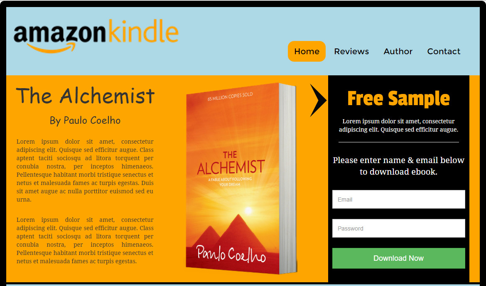

As you know, a perfect landing page helps you to provide the most convenient way to introduce your product in the global market. It also helps the consumers to understand to the point information about your service or brand. And for getting the best out of a <a href="https://blog.kissmetrics.com/beginners-guide-to-landing-pages/">landing page</a>, the HTML theme is the perfect option to choose. 

The ‘Amazon Kindle’ is a specially designed HTML template for the books publishing in kindle form. It makes possible to introduce your book in the most significant way to get the best sales rate and increase your popularity. 

<h3>Check the features of this best HTML template:</h3>

<ul>
<li>
The landing page will cover the design page of the book and a brief introduction about it including some testimonials and ‘buy now’ window

</li>
</ul>

<ul>
<li>
Unlike to other landing page templates, you will get web pages like Reviews, Author, and Contact Us page to add the all the key information about the book reviews, author bio and contact form

</li>
</ul>

<ul>
<li>
You can even add new pages or delete the unnecessary old pages which is the best advantage of an HTML template (easy content management)

</li>
</ul>

<ul>
<li>
It is responsive, so it fits in all type of device sizes and screens

</li>
</ul>

<ul>
<li>
The URL routed feature prevents duplicate titles and allows to create the right URL for the particular content

</li>
</ul>

<ul>
<li>
Search engine optimized theme with sharable option

</li>
</ul>

Why wait? If you are ready with your book and want a best platform to launch it on the world market, then get this top class HTML template ‘Amazon Kindle’ to sell out the books and be on the <a href="https://en.wikipedia.org/wiki/List_of_best-selling_books">bestselling book’s list</a>.

Good Luck!

<h3><b>Developer</b></h3>

<a href="http://www.bestoninternet.com/">Best on Internet</a>

<h3><a href="#demo">Demo</a></h3>

